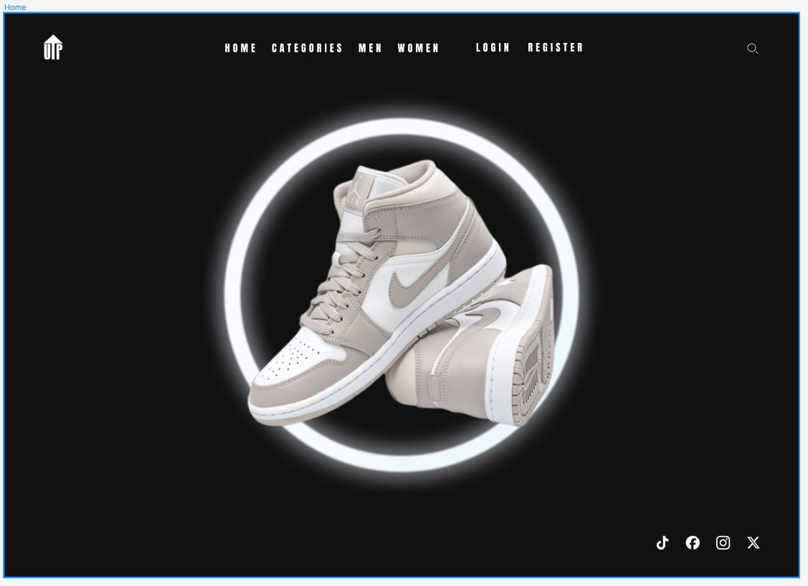
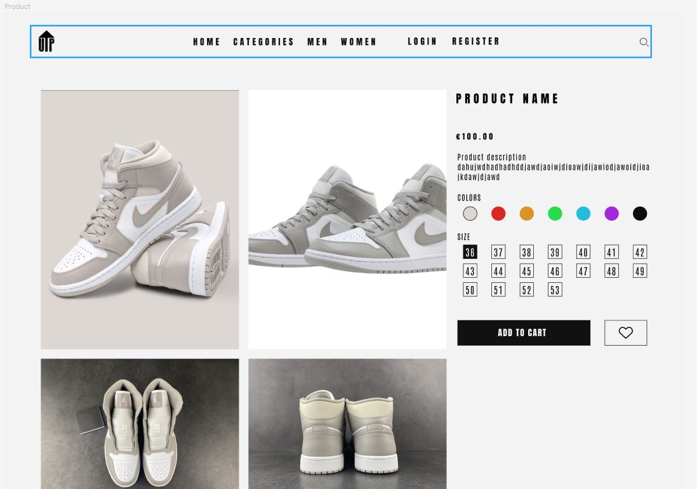

# UP_Project_Laboratorio_Engenharia

<h1>Como Executar</h1>

Abrir o terminal no VSCode (ou outra ide) e executar os comandos:

<ul>
  <li>cd project</li>
  <li>php artisan serve</li>
</ul>

<h1>Video</h1>

https://www.youtube.com/watch?v=FY6EoK0Yc5E&t=584s&ab_channel=JorgeDaniel

<h2>Design Imgs</h2>

<h1> Membros do Grupo:</h1>

Manuel Gonçalves: 43087

Jorge Ferreira: 43073

